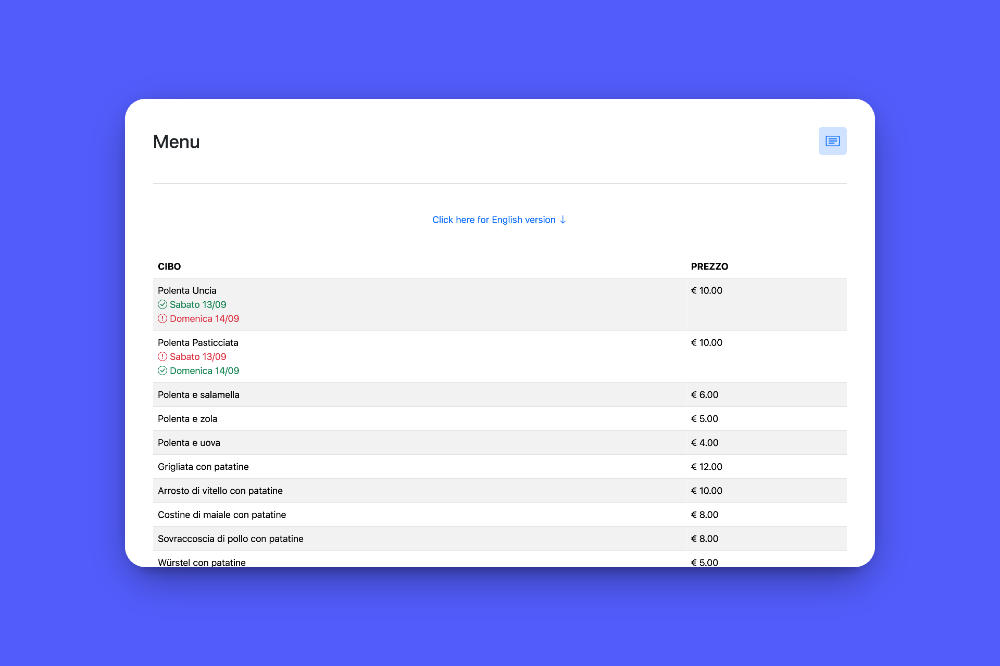

|  |
| - |

# San Bartolomeo

## Overview

This project is a utility repository. It is designed to host online resources for the San Bartolomeo feast, including menus, schedules, and other relevant information.

## Prerequisites

> [!IMPORTANT]
>
> - None

| <a href="https://robertovicario-chatbot.hf.space"></a> |
| :-: |
| **Menu - San Bartolomeo** |

## Instructions

Usage:

```sh
bash cmd.sh {build|deploy}
```

### `build`

To generate the static files for the project, run the following command:

```sh
bash cmd.sh build
```

After the build process completes, the static files will be available in the `dist` directory.

### `deploy`

To deploy the application to production, you can use the following command:

```sh
bash cmd.sh deploy
```

This project leverages GitHub Actions for CI/CD. The deployment workflow is configured to automatically build the project and deploy it to the GitHub Pages environment.

## License

This project is distributed under [GNU General Public License version 3](https://opensource.org/license/gpl-3-0). You can find the complete text of the license in the project repository.
